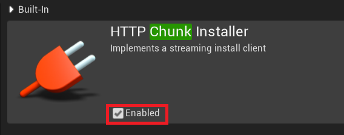

# UE4Chunk

# やったこと
* HTTPChunkInstaller プラグインを有効にする Enable HTTPChunkInstaller Plugin

* ChunkBuild.cs
~~~
ModuleNames = "HTTPChunkInstaller"
~~~

## [テスト用サーバ準備 Prepare test server](https://github.com/horinoh/UE4Analytics/tree/master/Document/Server)

# メモ Memo

## アセットに設定された ChunkID に基づいてパッケージ (.pak) に分割される
* ChunkID を持つ PrimaryAsset として管理、またはその SecondaryAsset として管理される

## PrimaryAsset
* PrimaryAssetID
* ChunkID

## アセットを PrimaryAsset、SecondaryAsset として管理する
* 複数の設定から ChunkID を指定される場合、アセットは両方の ChunkID に含まれることになる
    * 親 Chunk に含まれるアセットは、子 Chunk には含めない DefaultEngine.ini 設定
    ~~~
    [/Script/UnrealEd.ChunkDependencyInfo]
    +DependencyArray=(ChunkID=100,ParentChunkID=10)
    ~~~
### AssetManager
### PrimaryAssetLabel

## Chunk の確認
* AssetAudit
    * ReferenceViewer
    * SizeMap

## パッケージ
* ProjectSettings や ProjectLauncher で Chunk 設定をする
* CloudDir へ生成されたものをサーバにアップすれば良い
    * Manifest はバージョン等を持ち、再ダウンロードするかどうかの判断に使用される

## ダウンロード
* Chunk パッケージをサーバにアップ
* プラットフォーム毎の ini(Config/Windows/WindowsEngine.ini) にサーバ情報を追記
~~~
[HTTPChunkInstall]
TitleFileSource=Http
CloudProtocol=Http
CloudDomain=192.168.XXX.XXX
CloudDirectory=CloudDir

[HTTPOnlineTitleFile]
BaseUrl="192.168.XXX.XXX"
EnumerateFileUrl=CloudDir

[StreamingInstall]
DefaultProviderName=HTTPChunkInstaller
~~~
* HttpChunkInstaller プラグインを有効にする
* Build.cs の ModuleNames に "HTTPChunkInstaller" を追加

## ロード時に必要なアセットを自動ダウンロード (アセットのデータをメモリに乗せるところまで)
* AssetManager の ShouldAcquireMissingChunksOnLoad にチェック
~~~
UAssetManager::AsyncLoadPrimaryAssetXXX
UAssetManager::UnloadPrimaryAssetXXX
~~~
* PrimaryAsset が**直接**参照している SecoundaryAsset も自動ロードされる

### AssetBundle
* 専用の**タグ名**をつけた SecondaryAsset
    * AsyncLoadPrimaryAsssetXXX の引数に**タグ名**を渡してコールする
~~~
UPROPERTY(..., meta=(AssetBundles="Explicit"))
TArray<TSoftObjectPtr<UObject>> ExplicitAssets;
UPROPERTY(..., meta=(AssetBundles="Directory"))
...
UPROPERTY(..., meta=(AssetBundles="Collection"))
...
~~~

### アセットの取得
* UAssetManager::AsyncLoadPrimaryAssetXXX の返り値
* UAssetManager::GetAssetBundleEntry

#### AssetRegistry からアセットを検索する
* 自前でやるので大変、基本は PrimaryAsset から取れるような設計にしたほうが良い
* クラス名、パス名でフィルタリング検索可能
* FAssetData::GetAsset からアセットを取得
    * 未ダウンロードなら nullptr が返るので、UAssetManager::LoadAssetList でロードする

## ChunkID の設定を自動化するには
* UAssetManager::UpdateManagementDatabase に自動設定処理を追加する

<!--
アセットに設定されたChunkIDに基づいてゲームデータを.pakに分割
全アセットを PrimaryAsset(PA) と SecondaryAsset(SA) に分類し AssetManager(AM) で管理する
    PA は ChunkID を持ち AM で管理される
    SA は PA に紐づく (PA が直接or関節的に SA を参照している)
    複数の方法で ChunkID が設定されている場合、設定されている全ての ChunkID に含まれることになる
    
    Chunk 間のアセット競合回避 : 親子関係 (親Chunkに含まれるアセットは、子Chunkには含まれない)
    DefaultEngine.ini
    [/Script/UnrealEd.ChunkDependencyInfo]
    +DependencyArray=(ChunkID=100,ParentChunkID=11)

パッケージ作成処理後、CloudDir 以下を配信用サーバにアップすれば良い
    ini にサーバ設定を追加する
    HttpChunkInstaller プラグインを有効化する
    AM の Should Acquire Missing Chunk on Load を有効にする
        一括 DL : HttpChunkInstaller のリクエスト関数呼び出し
        随時 DL : AM のロード関数でその時必要なものを DL
            間接参照 SA は明示的にロード処理を呼ぶ必要あり -> AB にしましょう

AssetBundle(AB)
    タグ名が設定された間接参照 SA
    PA のロード時に、ロードしたい AB のタグ名を渡す

    UPROPERTY(..., meta=(AssetBundles="Explicit"))
    TArray<TSoftObjectPtr<UObject>> ExplicitAssets;

Chunkを割り当てる
    AssetManager(AM)
        PA、SAを管理
    PrimaryAssetLabel(PAL)
        ChunkID設定に特化したアセット
Chunkを表示
    AssetAudio(AA)
-->